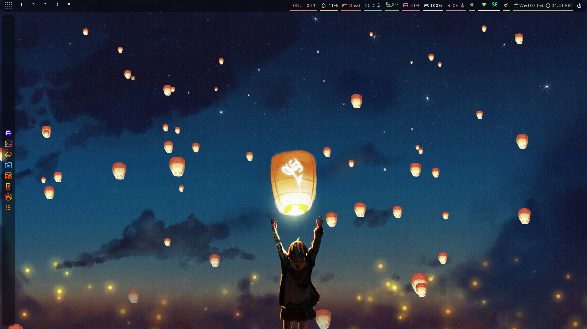
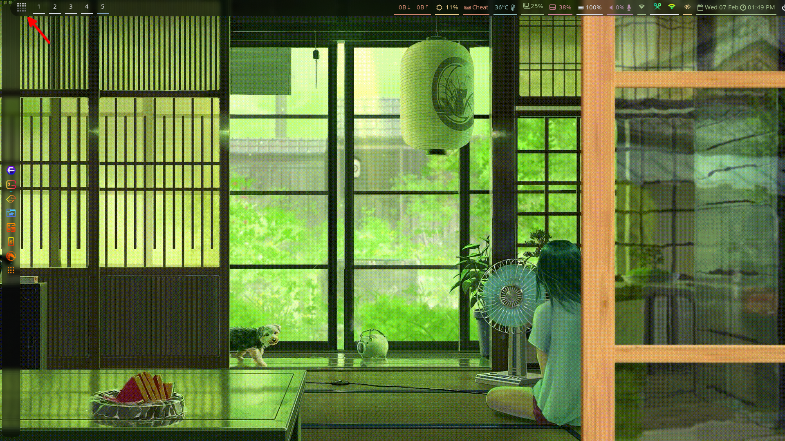

# nwg-dock-hyprland-configs-by-AnkurAlpha
### A small config provided by me for dock lovers 
This is a simple config provided by me for getting some fancy looking dock for 
for hyprland users.

#### how to use it 

copy and paste contents of `style.css` folder to `~/.config/nwg-dock-hyprland/style.css`

Then paste these lines into your `~/.config/hypr/hyprland.conf`: 
~~~
exec-once = sleep 10 && nwg-dock-hyprland -x -p "left"  -i 24 -mt 10 -mb 10 -ml 5 -f
bind = ALT SHIFT , H , exec, nwg-dock-hyprland -x -p "left"  -i 24 -mt 10 -mb 10 -ml 5 -f
layerrule = blur ,gtk-layer-shell 
layerrule = ignorezero ,gtk-layer-shell
~~~
Screenshot : 

#### INFO :
It will start the dock after ten seconds, after startup .
- why 10 second after startup ?

It is like this to prevent overlap in between waybar and the dock.

- ALT+SHFT+H is for turning off and on the dock, you can change it to your taste .

#### NOTE :
I am using garuda hyprland edition and this config is according to it,
if you are using any other OS then there can be theming issue for .
